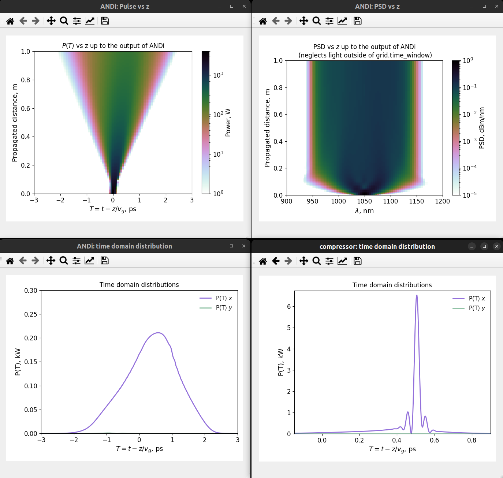

============
pyLaserPulse
============

pyLaserPulse is a comprehensive simulation toolbox for modelling polarization-resolved, on-axis laser pulse propagation through nonlinear, dispersive, passive, and active optical fibre assemblies, stretchers, and compressors. pyLaserPulse was developed with rapid prototyping of pulsed fibre systems in mind, and includes: an extensive catalogue of preset models of off-the-shelf components, material reflectivites, Raman response functions and rare-earth spectroscopic data, base types for modelling custom components, and a flexible API.

pyLaserPulse can be used to build highly accurate models of any (quasi-) single-mode, solid-core fibre system producing output pulses with durations ranging from just a few optical cycles to multiple nanoseconds [#]_. This includes fibre amplifiers, mode-locked fibre lasers, and supercontinuum generation.

pyLaserPulse includes:
    * Models of single and double clad step-index [#]_ and photonic crystal [#]_ passive and active fibres.

    * Models of free-space and fibre-coupled components.

    * A polarization-resolved generalised nonlinear Schrödinger equation (GNLSE) solver.

      - Fourth-order Runge-Kutta interaction picture method for integration (RK4IP) [#]_.

      - Conservation quantity error method adaptive step sizing [#]_.

      - Full dispersion and propagation loss.

      - Self-steepening, self-phase modulation, four-wave mixing (co- and cross-polarized), cross-phase modulation between polarization and wavelength components, and the full polarization-resolved Raman response [#]_.

    * The Giles model for gain and amplified spontaneous emission (ASE) [#]_.

      - Full integration of gain with the GNLSE for accurate modelling of highly nonlinear amplifiers.

      - Full boundary value solver for co and counter propagating pump and ASE light as well as a single-pass solver for rapid estimation of amplifier performance.

      - Core- and cladding-pumped fibre amplifiers.

      - A choice of frequency-domain or hybrid time- and frequency-domain operators.

    * Dispersion control.

      - Grating-based pulse compressors [#]_ (see also [#]_) including material reflectivity profiles and a scalar model of diffraction efficiency [#]_.

      - Single-mode fibre (SMF) pulse compression.

      - Optimization of grating and SMF compressors for maximized peak power.

      - Fibre Bragg gratings.

    * Quantum noise contributions including shot noise [#]_ and partition noise at partially reflective interfaces [#]_.

    * A comprehensive plot library with full Matplotlib functionality.

    * Easy integration with python's multiprocessing module for parallel CPU computing.

    * The freedom to customize all of the above.

pyLaserPulse uses python loops sparingly, relying instead on the numpy and scipy modules for most calculations to benefit from the highly optimized libraries on which these modules are based. Simulation execution time is therefore reasonable, and a modern laptop CPU (AMD Ryzen 7 5800H) can complete a typical nonlinear amplifier simulation (full GNLSE with co- and counter-propagating pump and ASE) in less than 5 s. A full system model comprising multiple amplifier stages, compression, and supercontinuum generation completes in a few minutes on the same processor (although systems which have large stretching ratios, such as fibre CPAs, require more time).

=======================
How to get pyLaserPulse
=======================
pyLaserPulse isn't on PyPI (yet), but it is easy to set up using the following steps:

**1)** Either download the code as a zip file, or install git and clone this repository using:

``git clone https://github.com/jsfeehan/pyLaserPulse.git``

**2)** Run the following command in the same directory into which pyLaserPulse has been downloaded/cloned:

``python setup.py install``

(Include the ``--user`` flag if you do not have admin or root privileges).

=============
The code [#]_
=============

Example 1 - A nonlinear Yb-doped fibre amplifier
================================================
The example below shows how to model a simple Yb-doped fibre amplifier comprised of off-the-shelf components using the ``catalogue_components`` module. A hybrid isolator/WDM precedes a 1 m length of step-index Yb-doped fibre which is core pumped in the signal propagation direction at 916 nm. The amplifier is seeded with a 150 fs, sech\ :sup:`2`\  input pulse with a peak power of 150 W and 30 dB polarization purity.

.. code:: python
    :number-lines:

        from pyLaserPulse import grid
        from pyLaserPulse import pulse
        from pyLaserPulse import optical_assemblies
        from pyLaserPulse import single_plot_window
        import pyLaserPulse.catalogue_components.active_fibres as af
        import pyLaserPulse.catalogue_components.fibre_components as fc

        #############################################
        # Choose a directory for saving the data.   #
        # Leave as None if no data should be saved. #
        #############################################
        directory = None

        ############################################################
        # Set time-frequency grid, pulse, and component parameters #
        ############################################################

        # Time-frequency grid parameters
        points = 2**9         # Number of grid points
        central_wl = 1030e-9  # Central wavelength, m
        max_wl = 1200e-9      # Maximum wavelength, m

        # Laser pulse parameters
        tau = 150e-15         # Pulse duration, s
        P_peak = [150, .15]   # [P_x, P_y], W
        f_rep = 40e6          # Repetition frequency, Hz
        shape = 'sech'        # Can also take 'Gauss'

        # isolator-WDM parameters
        L_in = 0.2       # input fibre length, m
        L_out = 0.2      # output fibre length, m

        # Yb-fibre parameters
        L = 1                                # length, m
        ase_points = 2**8                    # number of points in pump & ASE grid
        ase_wl_lims = [900e-9, max_wl]       # wavelength limits for ASE grid
        bounds = {'co_pump_power': 1,            # co-pump power, W
                  'co_pump_wavelength': 916e-9,  # co-pump wavelength, m
                  'co_pump_bandwidth': 1e-9,     # co-pump bandwidth, m
                  'counter_pump_power': 0}       # counter-pump power, W

        ##############################################################
        # Instantiate the time-frequency grid, pulse, and components #
        ##############################################################

        # Time-frequency grid defined using the grid module
        g = grid.grid(points, central_wl, max_wl)

        # pulse defined using the pulse module
        p = pulse.pulse(tau, P_peak, shape, f_rep, g)

        # Opneti isolator/WDM hybrid component from the catalogue_components module.
        iso_wdm = fc.Opneti_PM_isolator_WDM_hybrid(g, L_in, L_out, g.lambda_c)

        # Nufern PM-YSF-HI-HP defined using the catalogue_components module
        ydf = af.Nufern_PM_YSF_HI_HP(g, L, p.repetition_rate, ase_points, ase_wl_lims,
                                     bounds, time_domain_gain=True)

        ################################################################
        # Use the optical_assemblies module for automatic inclusion of #
        # coupling loss between components and for generating plots.   #
        ################################################################
        component_list = [iso_wdm, ydf]
        amp = optical_assemblies.sm_fibre_amplifier(
            g, component_list, plot=True, name='amp 1', high_res_sampling=100,
            data_directory=directory, verbose=True)

        ######################
        # Run the simulation #
        ######################
        p = amp.simulate(p)

        ##########################################################
        # Use the matplotlib_gallery module to display the plots #
        ##########################################################
        if amp.plot:
            plot_dicts = [amp.plot_dict]
            single_plot_window.matplotlib_gallery.launch_plot(plot_dicts=plot_dicts)

The ``optical_assemblies`` module used in the example above not only provides a simple way of turning a collection of component models into a convenient *assembly* which can then be simulated in a single line, it also generates plots which can be displayed using the ``single_plot_window.matplotlib_gallery`` module. The latter includes an intuitive, Qt-based gallery of plot thumbnails which, when clicked, are launched in a standard Matplotlib figure for full control over the plot visuals, axis limits, scaling, etc., as shown in the animation below.  

.. image:: docs/videos/simulation_gallery.gif
    :align: center

All components have a ``verbose`` keyword argument, but this is overridden by the same keyword argument passed to the ``__init__`` method of classes in the ``optical_assemblies`` module. When True, information about the progress of the simulation is printed to the terminal. The output for this example is given below. The amplifier name is printed, as well as the name of each component, the percentage propagation for the input and output fibres of each component, and the convergence of the boundary value solver for the active fibre.

.. code:: bash
    :number-lines:

        Simulating    amp 1
        --------------------

        Opneti_PM_isolator_WDM_hybrid
                100.0 %

                100.0 %

        fibreToFibreCoupling

        Nufern_PM_YSF_HI_HP
        Convergence error (spectral density only):
                 55.38206546671114
                 12.000573541512274
                 3.46398001489616
                 0.9014605622333454
                 0.24244909411684906
                 0.06411436939453781

        Convergence error (full field):
                 16.93329516050609
                 0.9818041820463349
                 0.19351727715062822
                 0.07243049202738491

Example 2 - Optical wavebreaking in all-normal-dispersion PCF and grating-based pulse compression
=================================================================================================

The code below models supercontinuum generation in PCF and compression of the spectrally-broadened pulses using a grating-based compressor. 100 fs, 5 kW seed pulses with a central wavelength of 1050 nm first pass through a free-space isolator (modelled using the ``base_components.component`` class) before being coupling into the PCF (modelled using the ``catalogue_components.passive_fibre.NKT_NL_1050_NEG_1`` class). The spectrally broadened and chirped pulses then propagate through the compressor (modelled using the ``base_components.grating_compressor`` class). The ``optimize`` keyword argument is set to ``True`` when the compressor is instantiated, so the compressor will be optimized for maximum pulse peak power by adjusting the grating angle and separation (diffraction efficiency vs. angle of incidence is incorporated automatically). The ``verbose`` keyword argument, also set to ``True``, means that the results of this optimization will be printed to the terminal.

.. code:: python
    :number-lines:

        from pyLaserPulse import grid
        from pyLaserPulse import pulse
        from pyLaserPulse import base_components
        from pyLaserPulse import data
        from pyLaserPulse import optical_assemblies
        from pyLaserPulse import single_plot_window
        import pyLaserPulse.catalogue_components.passive_fibres as pf

        #############################################
        # Choose a directory for saving the data.   #
        # Leave as None if no data should be saved. #
        #############################################
        directory = None

        ############################################################
        # Set time-frequency grid, pulse, and component parameters #
        ############################################################

        # Time-frequency grid parameters
        points = 2**14        # Number of grid points
        central_wl = 1050e-9  # Central wavelength, m
        max_wl = 8000e-9      # Maximum wavelength, m

        # Laser pulse parameters
        tau = 100e-15         # Pulse duration, s
        P_peak = [5000, 25]   # [P_x, P_y], W
        f_rep = 40e6          # Repetition frequency, Hz
        shape = 'Gauss'       # Can also take 'sech'

        # ANDi photonic crystal fibre parameters
        L_beat = 1e-2  # polarization beat length (m)
        L = 1          # length, m

        # grating compressor parameters
        loss = 0.04            # percent loss per grating reflection
        transmission = 700e-9  # transmission bandwidth
        coating = data.paths.materials.reflectivities.gold
        epsilon = 1e-1         # Jones parameter for polarization mixing and phase
        theta = 0              # Jones parameter for angle subtended by x-axis
        crosstalk = 1e-3       # polarization crosstalk
        beamsplitting = 0      # Useful for output couplers, etc.
        l_mm = 600             # grating lines per mm
        sep_initial = 1e-2     # initial guess for grating separation
        angle_initial = 0.31   # initial guess for incidence angle, rad

        ##############################################################
        # Instantiate the time-frequency grid, pulse, and components #
        ##############################################################

        # Time-frequency grid defined using the grid module
        g = grid.grid(points, central_wl, max_wl)

        # pulse defined using the pulse module
        p = pulse.pulse(tau, P_peak, shape, f_rep, g)

        # isolator
        iso = base_components.component(
            0.2, 250e-9, g.lambda_c, epsilon, theta, 0, g, crosstalk, order=5)

        # ANDi photonic crystal fibre - NKT NL-1050-NEG-1 - from catalogue_components
        pcf = pf.NKT_NL_1050_NEG_1(g, L, 1e-6, L_beat)

        # grating compressor defined using the base_components module
        gc = base_components.grating_compressor(
            loss, transmission, coating, g.lambda_c, epsilon, theta, beamsplitting,
            crosstalk, sep_initial, angle_initial, l_mm, g, order=5, optimize=True)

        ################################################################
        # Use the optical_assemblies module for automatic inclusion of #
        # coupling loss between components and for generating plots.   #
        ################################################################

        scg_components = [iso, pcf]
        scg = optical_assemblies.passive_assembly(
            g, scg_components, 'scg', high_res_sampling=100,
            plot=True, data_directory=directory, verbose=True)

        compressor_components = [gc]
        compression = optical_assemblies.passive_assembly(
            g, compressor_components, 'compressor', plot=True,
            data_directory=directory, verbose=True)

        ######################
        # Run the simulation #
        ######################
        p = scg.simulate(p)
        p = compression.simulate(p)

        ##########################################################
        # Use the matplotlib_gallery module to display the plots #
        ##########################################################
        if scg.plot or compression.plot:
            plot_dicts = [scg.plot_dict, compression.plot_dict]
            single_plot_window.matplotlib_gallery.launch_plot(plot_dicts=plot_dicts)

A few plots from this simulation are shown below. The development of the pulse and power spectral density over the length of ANDi PCF are shown in the top row (left and right, respectively), and the strongly-chirped pulse at the ANDi PCF output and the femtosecond pulse after the compressor are shown in the bottom row (left and right, respectively).

Keyword argument ``verbose`` was set to ``True`` when the ``compression`` optical assembly was instantiated, so information regarding the compressor optimization and the optimized compressor setup is printed to the terminal. This output is as follows:

.. code:: bash
    :number-lines:

	Optimizing the compressor
	-------------------------
	Convergence reached:  True
	Optimization info.:  ['requested number of basinhopping iterations completed successfully']
	Number of optimization iterations:  10

	Pulse compression data
	----------------------
	Grating separation: 4.998 mm
	Incident angle: 24.528 degrees.

	Pulse peak power with respect to peak power of transform limit:
 	        Before compressor: .98 %
	        After compressor: 39.64 %

=============
Documentation
=============
Documentation is still in progress, but the docstrings are detailed and there are example scripts which show how to model active and passive fibre systems and give a general overview of how to use pyLaserPulse (see pyLaserPulse/examples).

A lot of work has gone into debugging and finding 'gotchas', but these will spring up from time to time. If you have questions, comments, a bug to report, or suggestions for improvement, please get in touch via pylaserpulse@outlook.com.

===================
Citing pyLaserPulse
===================
pyLaserPulse has benefitted from information shared freely and generously by others who have published open-source code and research findings, contributed to discussions, and provided feedback. Because of this, pyLaserPulse has been released under a GPLv3 license in the hope that it will be useful for the ultrafast laser community. This license does not allow for the inclusion of a clause stipulating that this project must be cited, but do please consider adding the following citation if pyLaserPulse has been useful for your work:

Feehan, J. S. (2022). pyLaserPulse (Version 1.0.0) [Computer software]. https://github.com/jsfeehan/pyLaserPulse

By doing so, you will be encouraging others to get involved in this project, which will result in better, more feature-rich (and free!) software.

==========
References
==========

.. [#] Longer pulses can be modelled using pyLaserPulse, but this can lead to longer execution times if a broad wavelength grid is also needed because this requires a large number of time-frequency grid points. For >100 ns pulse to continuous-wave fibre laser and amplifier simulations requiring a broad wavelength grid, perhaps try the pyFiberAmp_ library (rate equation & boundary value solver with Raman; no GNLSE).
.. _pyFiberAmp: https://github.com/Jomiri/pyfiberamp/
.. [#] D Gloge, "Weakly guiding fibers", Applied Optics 10(10), pp 2252-2258 (1971)
.. [#] K Saitoh and M Koshiba, "Empirical relations for simple design of photonic crystal fibers", Optics Express 13(1), pp 267-274 (2005)
.. [#] J Hult, "A fourth-order Runge-Kutta in the interaction picture method for simulating supercontinuum generation in optical fibers", Journal of Lightwave Technology 25(12), pp. 3770-3775 (2007) and https://freeopticsproject.org
.. [#] A M Heidt, "Efficient adaptive step size method for the simulation of supercontinuum generation in optical fibers", Journal of Lightwave Technology 27(18), pp. 3984-3991 (2009) and https://freeopticsproject.org
.. [#] S Trillo and S Wabnitz, "Parametric and Raman amplification in birefringent fibers", Journal of the Optical Society of America B 9(7), pp. 1061-1082 (1992)
.. [#] C R Giles and E Desurvire, "Modeling erbium-doped fiber amplifiers", Journal of Lightwave Technology 9(2), pp 271-283 (1991)
.. [#] R L Fork, C H Brito Cruz, P C Becker, C V Shank, "Compression of optical pulses to six femtoseconds by using cubic phase compensation", Optics Letters 12(7), pp 483-485 (1987)
.. [#] F Kienle, "Advanced high-power optical parametric oscillators synchronously pumped by ultrafast fibre-based sources", PhD Thesis, University of Southampton, 2012 (see page 37). 
.. [#] R Casini and P G Nelson, "On the intensity distribution function of blazed reflective diffraction gratings", Journal of the Optical Society of America A 31(10), pp 2179-2184 (2014)
.. [#] P Drummond and J F Corney, "Quantum noise in optical fibers. I. Stochastic equations", Journal of the Optical Society of America B 18(2), pp 139-152 (2001)
.. [#] B Huttner and Y Ben-Aryeh, "Influence of a beam splitter on photon statistics", Physical Review A 38(1), pp 204-211 (1988)
.. [#] Manufacturers and suppliers mentioned in the example code are not affiliated with pyLaserPulse.
